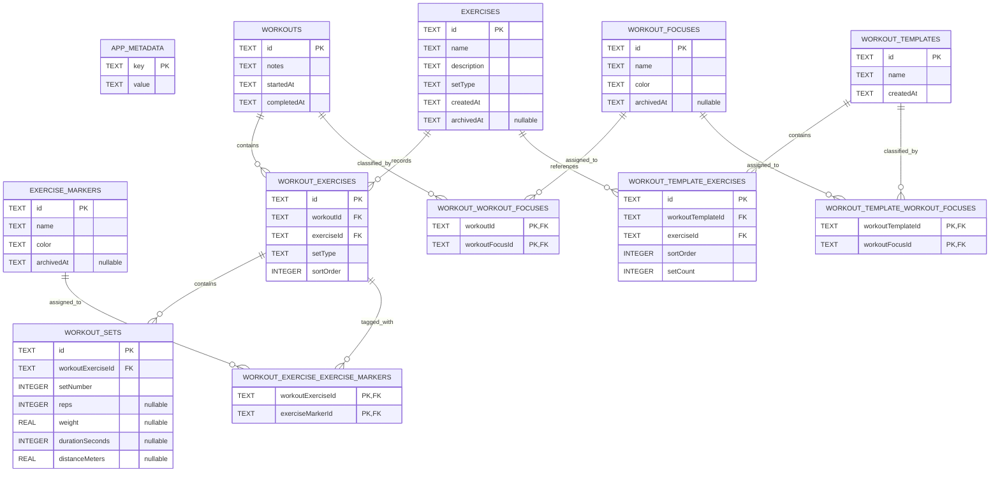

# SweatLogs database schema

SweatLogs uses SQLite. This diagram represents database schema version 2, defined in [`src/data/databaseMigrations.ts`](../src/data/databaseMigrations.ts).

## Legend

- `PK` - primary key; uniquely identifies a row.
- `FK` - foreign key; references a row in another table.
- `PK,FK` - part of a composite primary key and also a foreign key.
- `nullable` - the column may contain `NULL`.
- `||` - exactly one.
- `o{` - zero or many.
- `||--o{` - one parent can have zero or many children, while each child belongs to exactly one parent.

For example, one `WORKOUT_EXERCISE` can contain zero or many `WORKOUT_SETS`. Each set stores the relationship through `workout_sets.workoutExerciseId`, which references `workout_exercises.id`.

Deleting a workout, template, or owned workout exercise cascades to its child records. Deleting referenced exercises, focuses, and markers is restricted.
